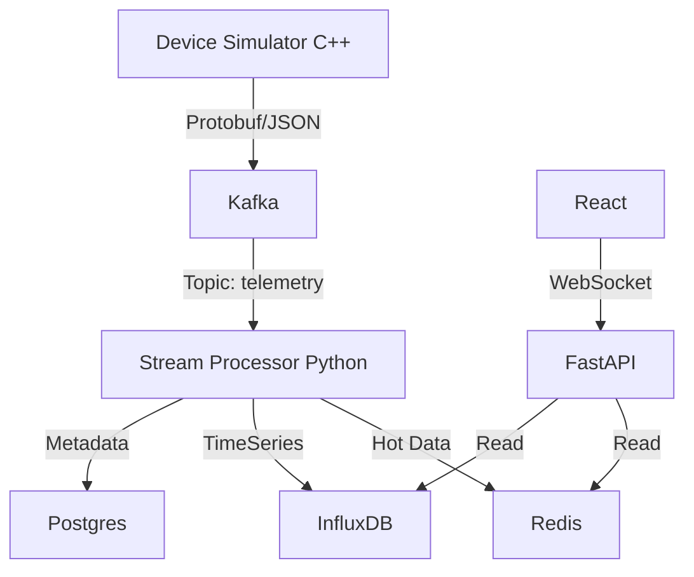

# Real-Time IoT Telemetry Pipeline - Walkthrough

## Project Overview
This project is a high-performance, cloud-native IoT telemetry pipeline designed to simulate 50,000+ devices, process their data in real-time, and visualize it on a modern dashboard.

### Key Components
1.  **Device Simulator (C++)**: Generates realistic telemetry (Smart Fan, AC, Light) and pushes to Kafka.
2.  **Streaming Layer**: Apache Kafka & Zookeeper.
3.  **Stream Processor (Python)**: Consumes data, aggregates metrics, and stores them in InfluxDB/Redis.
4.  **Backend API (FastAPI)**: Serves data to the frontend via WebSockets and REST endpoints.
5.  **Dashboard (React + Fluent UI)**: Real-time visualization of device status and metrics.

## Repository
The complete source code is available at: [azure-iot-kafka-pipeline](https://github.com/dipayansardar73-decode/azure-iot-kafka-pipeline)

## Setup & Deployment

### Prerequisites
- Docker & Docker Compose
- 4GB+ RAM available for containers

### Running the Pipeline
The entire stack is containerized. To launch:

```bash
docker-compose up -d --build
```

This will start:
- **Infrastructure**: Kafka (9092), Zookeeper (2181), Redis (6379), Postgres (5432), InfluxDB (8086)
- **Services**: Simulator, Processor, Backend (8000), Dashboard (80)

### Verification

#### 1. Dashboard
- Open [http://localhost](http://localhost) in your browser.
- You should see the **Overview** page with real-time counters for "Active Devices" and "Messages/Sec".
- Navigate to **Devices** to see a list of simulated appliances.

#### 2. Backend API
- Health check: [http://localhost:8000/health](http://localhost:8000/health)
- API Docs: [http://localhost:8000/docs](http://localhost:8000/docs)

#### 3. InfluxDB (Metrics)
- URL: [http://localhost:8086](http://localhost:8086)
- Login with default credentials (admin/password) to explore raw telemetry data.

## Architecture



## Troubleshooting
If services fail to start:
1.  Check logs: `docker-compose logs -f [service_name]`
2.  Restart specific container: `docker-compose restart [service_name]`
3.  Ensure ports 80, 8000, and 9092 are free.
